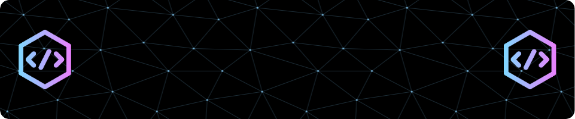

<h1 align="center">Hi 👋, I'm Johan Romeo</h1>
<h3 align="center">A passionate Software Developer with an interest in Fullstack Development</h3>

  

  

- 🔭 I’m currently spawning ideas for my upcoming personal Fullstack project.

- 🌱 I’m currently diving deeper into  **Quality Assurance** through **EC Utbildning.**
  

<h3 align="left">Languages and Tools:</h3>

  
        

   

  

